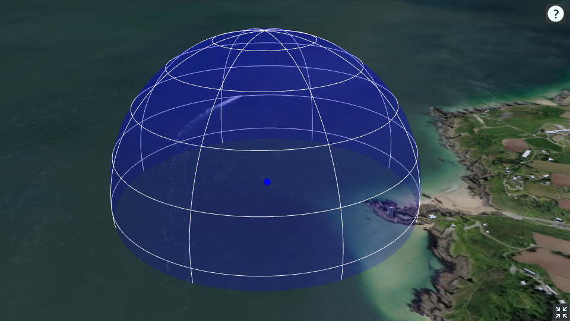

# 3dworld

Bienvenue dans **3dworld**, une application web utilisant CesiumJS pour afficher des données géospatiales en 3D. Cette application affiche un terrain mondial ainsi que des bâtiments et montre comment faire une sphère en 3D.

## Prérequis

Avant de commencer, assurez-vous d'avoir Node.js installé sur votre machine.

## Installation

1. Clonez le dépôt ou téléchargez les fichiers source:
   ```bash
   git clone https://github.com/Emie18/3dworld.git
   ```
2. Accédez au répertoire du projet:
   ```bash
   cd 3dworld
   ```
3. Installez les dépendances nécessaires:
   ```bash
   npm install
   ```

## Démarrage de l'application

Pour démarrer l'application, utilisez le serveur HTTP fourni par le module `http-server`:
```bash
npm start
```
Puis dans un navigateur ouvrir la page :
```
http://127.0.0.1:8080/essai.html
```
## Structure du Projet

- `index.html`: Fichier HTML principal contenant la structure de base de l'application.
- `script.js`: Fichier JavaScript principal pour initialiser et configurer CesiumJS.
- `package.json`: Fichier contenant les informations sur le projet et les dépendances nécessaires.

## Fonctionnalités

### Affichage du terrain mondial

L'application utilise `CesiumJS` pour afficher le terrain mondial avec les bâtiments OSM (OpenStreetMap).

### Personnalisation des widgets

- Suppression de la timeline.
- Suppression de l'animation (grande horloge).
- Suppression des sélecteurs de mode de scène et de couche de base.
- Suppression du bouton de retour à la vue initiale.

### Vue centrée sur les coordonnées spécifiques

- Coordonnées définies pour centrer la vue autour du `petit minou` avec une orientation spécifique ( au milieu de la sphère ).

### Ajout de primitives

- Ajout d'un point bleu avec une taille de 10 pixels aux coordonnées spécifiées.
- Ajout d'une grande sphère bleue et transparente autour de ce point.

## Remarques

 Assurez-vous de revoir le CSS pour une personnalisation complète selon vos besoins.

## capture d'écran du résultat

